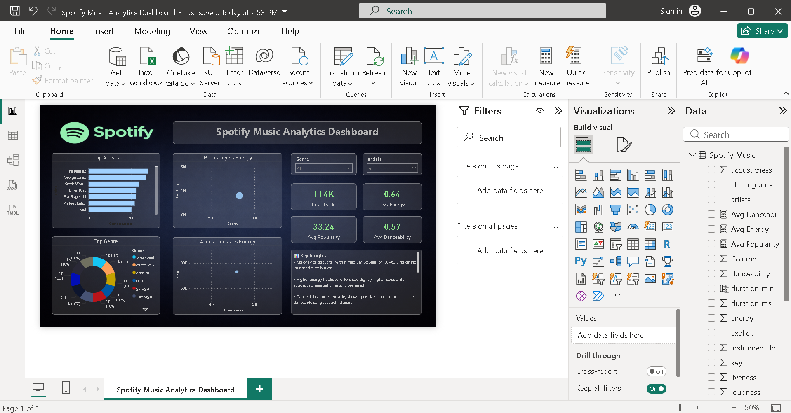

# 🎧 Spotify Music Analytics Dashboard

🚀 Built an interactive Power BI dashboard to analyze Spotify music trends and uncover actionable insights.

---

## 📊 Overview
This project presents an interactive **Power BI dashboard** analyzing Spotify music data to uncover trends in **popularity, energy, danceability, and genre distribution**.

It demonstrates strong skills in **data cleaning, analysis, and visualization using real-world data**.

---

## ⭐ Highlights
- Real-world Spotify dataset analysis  
- Business-focused insights  
- Clean and modern dashboard design  
- Interactive visual exploration  

---

## 🚀 Key Features

### 📌 KPI Metrics
- Total Tracks: **114K**  
- Avg Popularity: **33.24**  
- Avg Energy: **0.64**  
- Avg Danceability: **0.57**  

### 📊 Visual Analysis
- Top Artists by track count  
- Genre distribution (donut chart)  
- Popularity vs Energy correlation  
- Acousticness vs Energy relationship  

---

## 📈 Business Insights
- Majority of tracks fall under **medium popularity range (30–60)**  
- High-energy songs tend to perform better  
- Danceable songs are generally more popular  
- Acoustic tracks maintain consistent but moderate popularity  
- Most tracks are **vocal-based (low instrumentalness)**  
- Loudness and energy show strong positive correlation  

---

## 🛠️ Tech Stack
- Power BI  
- Python (Pandas for data cleaning)  
- Excel / CSV dataset  

---

## 📂 Dataset
Spotify dataset containing:
- Track details  
- Audio features (energy, danceability, acousticness, etc.)  
- Popularity metrics  

---

## 📸 Dashboard Preview

---

## 🎯 Project Objective
To analyze music trends and deliver **data-driven insights** that help understand listener preferences and support better decision-making.

---

## 📬 Connect with Me
- 💼 LinkedIn: https://www.linkedin.com/in/keshav0220  
- 💻 GitHub: https://github.com/Keshav0220  

---

⭐ If you like this project, consider giving it a star!
